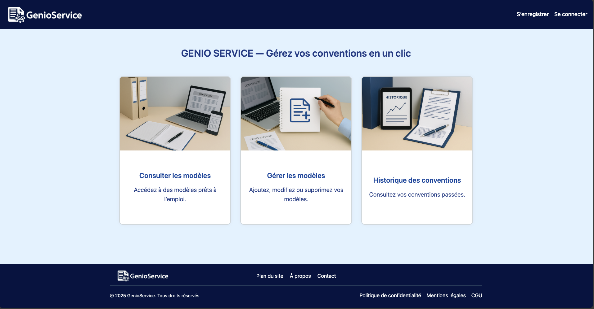
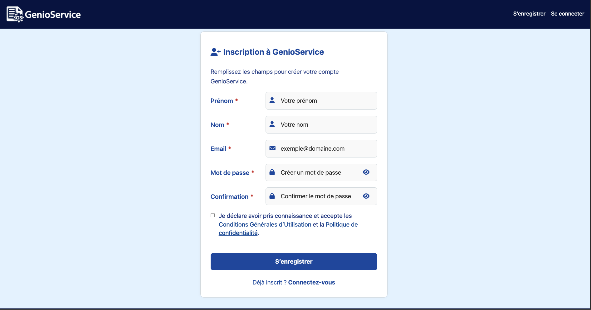

# Documentation fonctionnelle – GenioService

---

## Sommaire

- [Page d’accueil](#page-daccueil)
- [Écran de connexion](#écran-de-connexion)
- [Écran d’inscription](#écran-dinscription)
- [Écran de réinitialisation du mot de passe](#écran-de-réinitialisation-du-mot-de-passe)
- [Écran de réinitialisation du mot de passe - nouveau mot de passe](#écran-de-réinitialisation-du-mot-de-passe---nouveau-mot-de-passe)
## Page d’accueil

### Objectif de l’écran

L’écran d’accueil de GenioService est la porte d’entrée principale de l’application.  
Il permet à l’utilisateur d’accéder aux trois grandes fonctionnalités du service :
- Consulter des modèles prêts à l’emploi
- Gérer les modèles existants
- Consulter l’historique des conventions

---

### Aperçu de la page

  

---

### Fonctionnement de l’écran

- La page d’accueil est composée de **trois cartes interactives**.
- Chaque carte redirige vers la page de **connexion** (/connexion) si l’utilisateur n’est pas encore connecté.
- Une fois connecté, l’utilisateur accède à la fonctionnalité selon ses droits.

**Les trois cartes affichées :**
1. **Consulter les modèles**  
   Permet d’accéder à des modèles de conventions prêts à l’emploi.

2. **Gérer les modèles**  
   Permet d’ajouter, modifier ou supprimer des modèles.

3. **Historique des conventions**  
   Permet de visualiser les conventions déjà générées.

---

### Exigences fonctionnelles

- L’écran est **accessible sans authentification**.
- Les liens mènent tous vers la **page de connexion**.
- L’accès aux fonctionnalités est ensuite **filtré par rôle** utilisateur (décrit dans une section séparée de la documentation).
- Chaque carte est cliquable et bien lisible (titre + image + descriptif).
- Le design est **responsive** pour une utilisation sur desktop et mobile.

---

### Exigences techniques

- Application Angular 17
- routerLink vers /connexion utilisé sur chaque carte
- Images en loading="lazy" pour optimiser le chargement
- aria-label présent pour l’accessibilité
- Texte masqué avec .visually-hidden pour les lecteurs d’écran
- Structure HTML sémantique (main, nav, article, etc.)
- Mise en page responsive (grille adaptative CSS)

---

## Écran de connexion

### Objectif de l’écran

Permet à l’utilisateur de s’authentifier pour accéder à son espace GenioService.  
Obligatoire pour consulter, gérer ou visualiser des conventions.

---

### Aperçu de la page

  

---

## Fonctionnement de l’écran
- L’utilisateur saisit son **email** et son **mot de passe**.
- Le bouton **“Se connecter”** déclenche une requête d’authentification (POST /auth/login).
- En cas d’échec, un **message d’erreur** s’affiche dynamiquement (401 ou 403).
- En cas de succès :
  - Le rôle est récupéré via GET /api/utilisateurs/me
  - L’utilisateur est redirigé automatiquement vers la page consulter-modeles.
- Un lien **“Mot de passe oublié ?”** permet de réinitialiser le mot de passe.
- Un lien **“S’inscrire”** est accessible pour les nouveaux utilisateurs.

---

## Exigences fonctionnelles
- Tous les champs sont **obligatoires** (required HTML).
- Le champ **email** doit respecter un format valide.
- L’utilisateur est informé en cas d'erreur (email ou mot de passe incorrect / compte non activé).
- L'utilisateur peut **afficher/masquer le mot de passe** avec un bouton toggle.
- Les champs sont **accessibles au clavier** et compatibles lecteur d’écran (aria-*).
- Le lien vers la réinitialisation de mot de passe est visible sans être connecté.
- En cas de succès, un **message de confirmation** est affiché.

---

## Exigences techniques
- **Framework** : Angular 17
- **Composants utilisés** : FormsModule, NgIf, RouterLink
- **Services utilisés** :
  - HttpClient pour l’appel à l’API /auth/login
  - AuthService pour enregistrer l’utilisateur connecté
- **Gestion des erreurs** :
  - 401 → identifiants invalides
  - 403 → compte en attente de validation
  - Autres → message générique
- **Mot de passe** :
  - Minimum 12 caractères (côté validation serveur)
  - Possibilité d’affichage/masquage (fa-eye, fa-eye-slash)
- **Accessibilité** :
  - Champs annotés avec aria-label, aria-describedby, aria-invalid
  - Structure HTML claire avec role="form" et aria-labelledby
- **Design** :
  - Bouton désactivé pendant l’envoi ([disabled]="isSubmitting")
  - Composant responsive avec marges et alignements optimisés
  - Messages animés et temporisés (effacement automatique après 5 sec)

---

## Écran d’inscription

### Objectif de l’écran

Permet à un nouvel utilisateur de créer un compte GenioService.  
C’est l’étape préalable à toute utilisation du service.

---

### Aperçu de la page

  

---

## Fonctionnement de l’écran

- L’utilisateur doit renseigner :
  - **Prénom**
  - **Nom**
  - **Adresse e-mail**
  - **Mot de passe**
  - **Confirmation du mot de passe**

- Une fois tous les champs valides :
  - Le bouton **S’enregistrer** envoie les données via POST /api/utilisateurs
  - L’adresse e-mail est vérifiée pour **unicité** en temps réel (appel GET /exists)
  - Si inscription réussie, l’utilisateur est redirigé vers la page de **connexion**
  - En cas d’erreur, un message clair est affiché en haut du formulaire

- Le formulaire inclut une **vérification dynamique du mot de passe** :
  - La liste des règles non respectées est affichée en badges rouges sous le champ

---

## Exigences fonctionnelles

- Tous les champs sont **obligatoires** (required)
- Le mot de passe doit **respecter toutes les règles suivantes** :
  - Minimum **12 caractères**
  - Contenir **au moins 1 majuscule**
  - Contenir **au moins 1 chiffre**
  - Contenir **au moins 1 caractère spécial**
- Les mots de passe et confirmation doivent **être identiques**
- Si l’adresse e-mail existe déjà, un message s’affiche : Cet e-mail est déjà utilisé.
- En cas d’erreur, le message disparaît automatiquement après quelques secondes
- Accessibilité :
  - aria-label, aria-live, aria-describedby intégrés
  - Navigation clavier et lecteurs d’écran prise en charge
- Comportement responsive (PC et mobile)

---

## Exigences techniques

- **Framework** : Angular 17
- **Composants** : FormsModule, NgIf, NgForOf, RouterLink
- **Logique Angular** :
  - Requête POST /api/utilisateurs avec Content-Type: application/json
  - Requête GET /api/utilisateurs/exists?email= pour la vérification d’unicité
- **Sécurité** :
  - Aucun mot de passe transmis en clair
  - Affichage/masquage des champs mot de passe via bouton fa-eye
- **Accessibilité & UX** :
  - Badges d’erreur discrets pour les règles non respectées
  - Bouton désactivé pendant l’envoi ([disabled]="isSubmitting")
  - Aria busy actif durant le chargement
- **Redirection** :
  - Succès → redirection vers /connexion après 2 secondes

---

## Écran de réinitialisation du mot de passe

### Objectif de l’écran

Permet à l’utilisateur de demander un lien de réinitialisation de mot de passe par email.  
Cette fonctionnalité est destinée aux utilisateurs ayant oublié leur mot de passe.

---

### Aperçu de la page

  

---

### Fonctionnement de l’écran

- L’utilisateur saisit son **adresse e-mail** dans le champ prévu.
- En cliquant sur le bouton **"Réinitialiser"**, une requête `POST /auth/mot-de-passe-oublie` est envoyée.
- Si l’email est associé à un compte existant :
  - Un email de réinitialisation est envoyé.
  - Un **message de succès** est affiché : _"Un e-mail de réinitialisation a été envoyé si votre adresse est enregistrée."_
- En cas d’erreur :
  - Un **message d’erreur** s’affiche dynamiquement.
- Un lien **"Se connecter"** permet de revenir à la page de connexion.

---

### Exigences fonctionnelles

- Champ **e-mail obligatoire** et validé (`required` + format email)
- Envoi sécurisé de la requête au backend (`POST`)
- Affichage :
  - D’un **message d’erreur** en cas d’échec
  - D’un **message de confirmation** même si l’email n’existe pas (pour éviter l’exploitation)
- Accessibilité :
  - `aria-label`, `aria-describedby`, `aria-invalid`, `aria-live`
  - Navigation **clavier** et **lecteurs d’écran** supportés
- Bouton désactivé pendant la soumission
- Redirection manuelle possible vers la page de connexion

---

### Exigences techniques

- **Framework** : Angular 17
- Composants : `FormsModule`, `NgIf`, `NgClass`, `RouterLink`
- API :
  - `POST /auth/mot-de-passe-oublie` avec `Content-Type: application/json`
- Accessibilité & UX :
  - `aria-labelledby="reset-title"` pour le formulaire
  - `aria-describedby` dynamique selon l’état d’erreur
  - Bouton avec `aria-busy` pendant l’envoi
- Sécurité :
  - Message neutre, identique que l’email existe ou non
  - Aucune information sensible révélée côté frontend
- Design :
  - Interface centrée
  - Message temporaire (5 secondes pour erreur, 2 secondes pour succès)

---

## Écran de réinitialisation du mot de passe - nouveau mot de passe

### Objectif de l’écran

Cet écran permet à l’utilisateur de définir un **nouveau mot de passe** après avoir cliqué sur le lien reçu par email.  
C’est la dernière étape de la procédure “Mot de passe oublié”.

---

### Aperçu de la page

  

---

### Fonctionnement de l’écran

- L’utilisateur saisit :
  - Un **nouveau mot de passe**
  - Une **confirmation de ce mot de passe**
- Une **vérification dynamique** affiche les règles non respectées.
- Une fois toutes les règles respectées :
  - Le bouton **"Réinitialiser et connecter"** devient actif.
  - Une requête `POST /auth/reset-password` est envoyée avec le **token** en paramètre.
- En cas de succès :
  - Le mot de passe est mis à jour.
  - L’utilisateur est automatiquement redirigé vers la **page de connexion** après 2 secondes.
- En cas d’erreur :
  - Un message d’erreur s’affiche dynamiquement.

---

### Exigences fonctionnelles

- Champs obligatoires : **nouveau mot de passe** et **confirmation**
- Le mot de passe doit respecter toutes les **règles de sécurité** :
  - Minimum **12 caractères**
  - Contenir **1 majuscule**
  - Contenir **1 chiffre**
  - Contenir **1 caractère spécial**
- Le mot de passe et sa confirmation doivent **être identiques**
- Un **feedback en temps réel** indique les règles non respectées (badges rouges)
- Un **message de succès** ou d'erreur est affiché dynamiquement
- Accessibilité :
  - `aria-label`, `aria-describedby`, `aria-live`
  - Champs accessibles via le clavier
  - Affichage/Masquage du mot de passe possible (`fa-eye`, `fa-eye-slash`)

---

### Exigences techniques

- **Framework** : Angular 17
- **Composants Angular** : `FormsModule`, `NgIf`, `NgForOf`
- **API** :
  - `POST /auth/reset-password` avec `token` et `nouveauMotDePasse`
- **Sécurité** :
  - Aucune information sensible stockée en local
  - Le token est lu dans `queryParams` pour sécuriser le lien
- **UX & accessibilité** :
  - Validation instantanée des règles de mot de passe
  - Bouton désactivé pendant la soumission (`[disabled]="isSubmitting"`)
  - Message temporaire (succès ou erreur)

---

## Métadonnées

- **Dernière mise à jour** : 29 mai 2025
- **Rédactrice** : Elsa HADJADJ
- **Version** : 1.0  